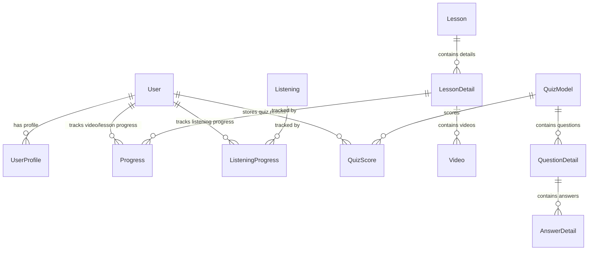

# 📘 Japanese Learning Platform — Developer Guide Book

> **Project Name:** Japanese Learning Platform (Sem VII Python Project)  
> **Repository:** [Hufoda/jp](https://github.com/Hufoda/jp)  
> **Tech Stack:** Python 3.12+, Django 5.1+, PostgreSQL / SQLite, Gunicorn, WhiteNoise, HTML5/CSS3/JS  
> **Target Audience:** Incoming Developers, Code Reviewers, and Maintainers  

---

## 📑 Table of Contents

1. [Project Overview](#1-project-overview)
2. [Technology Stack & Architecture](#2-technology-stack--architecture)
3. [Repository Directory Structure](#3-repository-directory-structure)
4. [Database & Data Models Schema](#4-database--data-models-schema)
5. [Local Development Setup](#5-local-development-setup)
6. [Environment Variables Reference](#6-environment-variables-reference)
7. [Core Application Features & Modules](#7-core-application-features--modules)
8. [Deployment Guide (Render Cloud Platform)](#8-deployment-guide-render-cloud-platform)
9. [Optional Cloud Storage (AWS S3)](#9-optional-cloud-storage-aws-s3)
10. [Developer Commands & Workflow Cheat Sheet](#10-developer-commands--workflow-cheat-sheet)
11. [Troubleshooting & Common Pitfalls](#11-troubleshooting--common-pitfalls)

---

## 1. Project Overview

The **Japanese Learning Platform** is a full-featured Django web application designed for learners studying Japanese across all JLPT (Japanese Language Proficiency Test) levels: **N5 (Beginner) through N1 (Advanced)**.

### Key Capabilities
- 📚 **Structured JLPT Lessons**: Categorized video lessons for Kanji, Grammar, Vocabulary, and Reading.
- 🎯 **Interactive Quizzes**: Multiple-choice quizzes categorized by level and topic with automated score tracking.
- 🎴 **Digital Flashcards**: Double-sided visual flashcards for active recall study.
- 🎧 **Listening Exercises**: Embedded audio player with transcripts and completion tracking.
- 📖 **Reference Library**: Downloadable PDF reference materials sorted by JLPT levels.
- 📊 **Learner Progress Dashboard**: Real-time progress monitoring across lessons, quizzes, and listening modules.
- 👥 **Role-Based Content & Admin Tools**: Seamless content management and user administration.

---

## 2. Technology Stack & Architecture

### Backend Framework
- **Python 3.12+**
- **Django 5.1+** (MVC / MVT architecture)

### Database Layer
- **SQLite3** for zero-config local development.
- **PostgreSQL** (via `dj-database-url` and `psycopg2-binary`) for production deployment.

### Static & Media Assets
- **WhiteNoise 6.6+** with `CompressedManifestStaticFilesStorage` for serving static assets (CSS, JS, images) in production without requiring external web servers like Nginx.
- **Pillow 10.0+** for image processing (Flashcard and Post images).
- **Django Storages + Boto3** for optional AWS S3 cloud media hosting.

### Production WSGI Server
- **Gunicorn 22.0+**

### Deployment Infrastructure
- **Render.com** (managed via `render.yaml` Infrastructure-as-Code Blueprint).

---

## 3. Repository Directory Structure

```
SemVII_PythonProject/
├── render.yaml               # Render Infrastructure-as-Code (Web Service + Postgres DB)
├── README.md                 # Basic quickstart guide
├── DEVELOPER_GUIDE.md        # Comprehensive Developer Guide Book (This Document)
├── .gitattributes            # Line ending rules (enforces LF for .sh scripts)
├── .gitignore                # Git exclusions (venv, sqlite3, local .env, media)
└── myDjango/                 # Root Django Project Working Directory
    ├── manage.py             # Django CLI administrative entry point
    ├── build.sh              # Production build & deployment script (LF line endings)
    ├── requirements.txt      # Python package dependencies
    ├── backup.json           # Initial database seed fixture (sample data)
    ├── .env.example          # Template for environment variables
    ├── staticfiles/          # Collected static assets (generated by collectstatic)
    ├── media/                # Local uploaded files (video, audio, images, books)
    │
    ├── myDjango/             # Core Project Configuration Package
    │   ├── __init__.py
    │   ├── settings.py       # Main settings (database, auth, security, Whitenoise, S3)
    │   ├── urls.py           # Root URL routing configuration
    │   ├── wsgi.py           # WSGI entry point for Gunicorn
    │   └── asgi.py           # Async server entry point
    │
    ├── japan/                # Main Application Package
    │   ├── models.py         # All Django ORM models (Lessons, Quizzes, Flashcards, Progress)
    │   ├── views.py          # View functions & business logic handlers
    │   ├── urls.py           # Application URL routes
    │   ├── form.py           # Django forms for content creation & user authentication
    │   ├── utils.py          # Helper functions (e.g., check_level_up logic)
    │   ├── admin.py          # Admin interface customizations
    │   ├── templates/        # App-level templates (if applicable)
    │   └── static/           # Application static files (CSS, JS, images)
    │
    └── Templates/            # Global HTML Templates (FirstPage, Quiz, Lessons, etc.)
```

---

## 4. Database & Data Models Schema

The application features 14 core database models located in `myDjango/japan/models.py`:



### Model Specifications

| Model Name | Purpose | Key Fields |
|------------|---------|------------|
| **`Lesson`** | Represents a JLPT level grouping | `level` (N5, N4, N3, N2, N1) |
| **`LessonDetail`** | Specific lesson topic | `lesson` (FK), `title`, `description`, `order`, `archived` |
| **`Video`** | Video resource attached to a lesson | `lesson` (FK), `video_type` (kanji, grammar, vocab, reading, other), `video` (FileField), `archived` |
| **`Progress`** | Tracks user completion of lesson/video | `user` (FK), `lesson_detail` (FK), `video` (FK), `completed` (Bool), `completed_at` |
| **`Listening`** | Audio listening exercise | `title`, `audio_file`, `description`, `transcript`, `archived` |
| **`ListeningProgress`** | User progress on listening exercises | `user` (FK), `listening` (FK), `completed` |
| **`ReferenceBook`** | PDF resource books | `title`, `level`, `file`, `archived` |
| **`QuizModel`** | Quiz container | `quiz_level`, `quiz_type`, `title` |
| **`QuestionDetail`** | Quiz question | `qzQuestion` (FK to QuizModel), `qzText` |
| **`AnswerDetail`** | Answer option for a question | `question` (FK), `ansText`, `is_correct` (Bool) |
| **`QuizScore`** | Recorded user score on a quiz | `user` (FK), `quiz` (FK), `score` (Int), `date_taken` |
| **`ImageCard`** | Double-sided visual flashcard | `title`, `level`, `front_image`, `back_image`, `created_at` |
| **`UserProfile`** | Extension of Django `User` model | `user` (OneToOne), `level` (Int, defaults to 5 for N5). Auto-created via `post_save` signal. |
| **`Achievement`** | Audit trail for edited/deleted content | `original_model`, `original_pk`, `title`, `text`, `action` (edited/deleted), `changed_by` (FK) |

---

## 5. Local Development Setup

Follow these step-by-step instructions to run the application on your local development machine.

### Prerequisites
- **Python 3.12+** installed (`python --version`)
- **Git** installed (`git --version`)

### Step 1: Clone the Repository

```bash
git clone https://github.com/Hufoda/jp.git
cd jp/SemVII_PythonProject/myDjango
```

### Step 2: Create & Activate Virtual Environment

**Windows (PowerShell):**
```powershell
python -m venv ..\.venv
..\.venv\Scripts\activate
```

**Linux / macOS:**
```bash
python3 -m venv ../.venv
source ../.venv/bin/activate
```

### Step 3: Install Dependencies

```bash
pip install -r requirements.txt
```

### Step 4: Configure Environment File

Copy `.env.example` to create your local `.env` file:

**Windows (PowerShell):**
```powershell
copy .env.example .env
```

**Linux / macOS:**
```bash
cp .env.example .env
```

Default local `.env` settings:
```ini
SECRET_KEY=django-insecure-local-dev-key
DEBUG=True
ALLOWED_HOSTS=localhost,127.0.0.1
USE_S3=False
```

### Step 5: Run Database Migrations

```bash
python manage.py migrate
```

### Step 6: Load Initial Seed Data (Optional but Recommended)

Seed the database with sample lessons, quizzes, and books:

```bash
python manage.py loaddata backup.json
```

### Step 7: Create a Admin Superuser

```bash
python manage.py createsuperuser
```

### Step 8: Start the Local Development Server

```bash
python manage.py runserver
```

Open your browser and navigate to **`http://127.0.0.1:8000/`**.  
Access the Django Admin dashboard at **`http://127.0.0.1:8000/admin/`**.

---

## 6. Environment Variables Reference

| Environment Variable | Required in Prod? | Default Value | Description |
|----------------------|-------------------|---------------|-------------|
| `SECRET_KEY` | **Yes** | `django-insecure-...` | Cryptographic key for session signing and security. |
| `DEBUG` | **Yes** | `True` | Set `False` in production. Controls detailed error screens. |
| `ALLOWED_HOSTS` | **Yes** | `.onrender.com,localhost,127.0.0.1` | Comma-separated domains allowed to serve the app. |
| `DATABASE_URL` | **Yes (Prod)** | None (uses SQLite locally) | PostgreSQL connection string (auto-provided by Render). |
| `CSRF_TRUSTED_ORIGINS` | **Yes (Prod)** | `https://*.onrender.com` | Comma-separated origins trusted for POST requests. |
| `SECURE_SSL_REDIRECT` | Optional | `True` (when `DEBUG=False`) | Enforces HTTPS redirection in production. |
| `USE_S3` | Optional | `False` | Set `True` to enable AWS S3 for media uploads. |
| `AWS_ACCESS_KEY_ID` | If `USE_S3=True` | None | AWS IAM Access Key. |
| `AWS_SECRET_ACCESS_KEY` | If `USE_S3=True` | None | AWS IAM Secret Access Key. |
| `AWS_STORAGE_BUCKET_NAME` | If `USE_S3=True` | None | Name of the AWS S3 bucket. |
| `AWS_S3_REGION_NAME` | If `USE_S3=True` | `us-east-1` | AWS S3 bucket region. |

---

## 7. Core Application Features & Modules

### 1. User Authentication & Authorization
- Routes: `/login/`, `/signup/`, `/logout/`
- Automatic creation of `UserProfile` via Django signals upon user registration.

### 2. Level Selection & Lessons (`japan/views.py`)
- Routes: `/level/`, `/lessons/<str:level>/`, `/lesson/<int:lesson_detail_id>/`
- Navigation split across **N5, N4, N3, N2, N1**.
- Video completion tracking: Learners mark videos as completed, storing state in `Progress` & `VideoProgress` models.

### 3. Quizzes & Automated Scoring
- Routes: `/quiz/`, `/quizzes/<str:level>/`, `/quiz/<int:quiz_id>/`
- Dynamically renders questions (`QuestionDetail`) and multiple-choice answers (`AnswerDetail`).
- Calculates scores and records historical attempts in `QuizScore`.
- Triggers automatic level progression checking via `utils.check_level_up()`.

### 4. Visual Flashcards
- Routes: `/flash/<str:level>/`, `/add/<str:level>/`
- Interactive card flipping UI (front and back images) powered by CSS transitions.

### 5. Listening Exercises
- Routes: `/listening/`, `/new/`
- Audio playback, transcripts, and completion status stored in `ListeningProgress`.

### 6. Reference Book Library
- Routes: `/book/`, `/adding/`
- Allows uploading and downloading PDF learning materials organized by JLPT level.

### 7. Audit Trail & Restoration (`Achievement`)
- Tracks edited or soft-deleted items across posts and lessons, enabling audit recovery via `/restore/<int:post_id>/`.

---

## 8. Deployment Guide (Render Cloud Platform)

The project includes built-in **Infrastructure-as-Code** support for deploying to [Render](https://render.com) using `render.yaml`.

### Render Deployment Workflow

1. **Push Code to GitHub**: Ensure all changes are committed and pushed to `main`.
2. **Create New Blueprint on Render**:
   - Log into [Render Dashboard](https://dashboard.render.com/).
   - Click **New +** -> **Blueprint**.
   - Connect your GitHub repository (`Hufoda/jp`).
3. **Automatic Resource Creation**:
   - Render automatically provisions a **Python Web Service** and a **PostgreSQL Database** (`japanese-learning-db`).
   - The build process automatically runs `myDjango/build.sh`, which executes:
     1. `pip install -r requirements.txt`
     2. `python manage.py collectstatic --no-input`
     3. `python manage.py migrate --no-input`
4. **Post-Deployment Initialization**:
   - In the Render Dashboard, open the **Shell** tab of your web service and run:
     ```bash
     python manage.py createsuperuser
     python manage.py loaddata backup.json
     ```

### Health Check Endpoint
- Health check URL: `https://your-app-name.onrender.com/health/` (Returns `200 OK`).

---

## 9. Optional Cloud Storage (AWS S3)

On Render's free tier, local disk storage is ephemeral (uploaded media files like user-submitted PDFs or videos are erased when the service restarts).

To make media uploads permanent:

1. Create an AWS S3 Bucket (uncheck "Block all public access" or configure CORS for your domain).
2. Set the following environment variables in Render Dashboard:
   ```ini
   USE_S3=True
   AWS_ACCESS_KEY_ID=your_aws_access_key
   AWS_SECRET_ACCESS_KEY=your_aws_secret_key
   AWS_STORAGE_BUCKET_NAME=your_s3_bucket_name
   AWS_S3_REGION_NAME=us-east-1
   ```
3. `django-storages` and `boto3` (already included in `requirements.txt`) will route all media file uploads directly to AWS S3.

---

## 10. Developer Commands & Workflow Cheat Sheet

### Common Management Commands

```bash
# Change directory to the Django root
cd myDjango

# Run local development server
python manage.py runserver

# Make new database migration files after model edits
python manage.py makemigrations

# Apply pending database migrations
python manage.py migrate

# Perform Django deployment security check
python manage.py check --deploy

# Export database data to fixture file
python manage.py dumpdata japan --indent 2 > backup.json

# Import database fixture file
python manage.py loaddata backup.json

# Open interactive Django Python shell
python manage.py shell
```

---

## 11. Troubleshooting & Common Pitfalls

### 1. `Permission Denied` when running `build.sh` on Render
- **Cause**: Git tracked `build.sh` as non-executable (`100644`).
- **Fix**: Run `git update-index --chmod=+x myDjango/build.sh` and push to GitHub.

### 2. `bash\r: command not found` or `/usr/bin/env: 'bash\r'`
- **Cause**: Shell script has Windows CRLF line endings instead of Unix LF.
- **Fix**: Convert `build.sh` to LF line endings. `.gitattributes` has been added to enforce this automatically.

### 3. `400 Bad Request` or `Invalid HTTP_HOST header`
- **Cause**: Render domain not listed in `ALLOWED_HOSTS`.
- **Fix**: `settings.py` is configured to automatically allow `.onrender.com` domains and `RENDER_EXTERNAL_HOSTNAME`.

### 4. Uploaded media files disappearing on Render
- **Cause**: Render's free tier filesystem is ephemeral.
- **Fix**: Enable AWS S3 by setting `USE_S3=True` with your AWS credentials as detailed in [Section 9](#9-optional-cloud-storage-aws-s3).

---

*This guide book was created for the Japanese Learning Platform maintainers. For questions or bug reports, please open an issue in the GitHub repository.*
