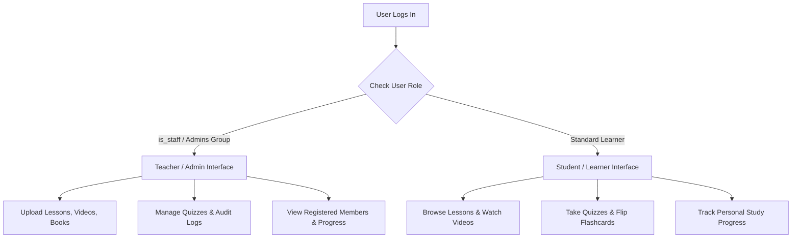

# 🚀 Future Implementations & Architecture Roadmap

> **Project Name:** Japanese Learning Platform  
> **Document Purpose:** Architecture reference for Student/Teacher Dual UI and technical roadmap for future developers.  

---

## 📑 Table of Contents

1. [Dual UI Architecture (Student vs. Teacher)](#1-dual-ui-architecture-student-vs-teacher)
2. [Role Permission Matrix](#2-role-permission-matrix)
3. [Proposed Technical Enhancements](#3-proposed-technical-enhancements)
4. [Backend API Expansion Plan (DRF)](#4-backend-api-expansion-plan-drf)
5. [Automated Testing & CI/CD Strategy](#5-automated-testing--cicd-strategy)

---

## 1. Dual UI Architecture (Student vs. Teacher)

The platform is designed with a **Dual-Role User Interface** served dynamically from a single codebase based on the logged-in user's role.



### How Dual UI is Enforced
1. **Global Context Processor (`japan.context_processors.admin_status`)**:
   Injected into all templates automatically via `settings.py`. It provides `is_admin` variable (`True` for Teachers, `False` for Students).
2. **View-Level Guards**:
   Views that modify content (Create, Edit, Delete) are protected using `@user_passes_test(is_admin, login_url='forbidden_page')` and `request.user.is_staff` checks.
3. **Template Conditionals**:
   Templates use `` to conditionally display management tools (e.g., *Upload Video*, *Edit Question*, *Delete Book*, *Audit Logs*) vs. student view modes.

---

## 2. Role Permission Matrix

| Feature / Route | Student (Learner) | Teacher (Admin / Staff) |
|-----------------|-------------------|-------------------------|
| **Lesson & Level Browsing** (`/level/`, `/lessons/<level>/`) | ✅ View & Study | ✅ View + ➕ Add / Delete Lessons |
| **Video Lessons** (`/lesson/<id>/`) | ✅ Watch & Mark Completed | ✅ Watch + 🎬 Upload / Archive Videos |
| **Quizzes** (`/quizzes/<level>/`, `/quiz/<id>/`) | ✅ Take Quizzes & See Score | ✅ Take + 📝 Add Quizzes / Edit Questions |
| **Flashcards** (`/flash/<level>/`) | ✅ Flip & Study Cards | ✅ Study + 🎴 Upload New Cards |
| **Listening Exercises** (`/listening/`) | ✅ Play Audio & Transcripts | ✅ Play + 🎧 Upload Audio Exercises |
| **Reference Books** (`/book/`) | ✅ Download PDFs | ✅ Download + 📚 Upload / Delete Books |
| **Community Feed** (`/home/`) | ✅ View Posts | ✅ View + ✍️ Publish Posts / Audit Logs |
| **Member Dashboard** (`/progress/`) | 📊 Personal Progress | 👥 All Registered Members Audit |

---

## 3. Proposed Technical Enhancements

Below is the recommended roadmap for future developers expanding this codebase:

### 1. Ephemeral Media Storage Migration (AWS S3 / Cloudinary)
- **Current State:** Media files (PDFs, Videos, Audio) are saved locally on disk (`media/`).
- **Future Upgrade:** Render free tier storage is temporary. Migrate to **AWS S3** or **Cloudinary** by setting `USE_S3=True` and providing S3 API keys in environment variables.

### 2. Spaced Repetition System (SRS) for Flashcards
- **Feature Idea:** Implement an Anki-style SuperMemo (SM-2) algorithm for the visual flashcard module (`ImageCard`).
- **Benefit:** Automatically schedules flashcards based on student recall rating (Easy, Good, Hard, Again), dramatically improving Japanese vocabulary retention.

### 3. Video HLS Streaming / External Hosting
- **Feature Idea:** Replace raw MP4 file uploads with embedded video streams (e.g., YouTube Unlisted, Vimeo, or AWS CloudFront HLS).
- **Benefit:** Saves bandwidth, prevents server storage bloat, and provides adaptive bitrate streaming for low-mobile bandwidth learners.

### 4. Interactive Timed Quizzes & Question Pools
- **Feature Idea:** Add a countdown timer to quizzes and randomize questions from a question bank (`QuestionDetail`).
- **Benefit:** Prepares students for realistic JLPT exam conditions under time constraints.

---

## 4. Backend API Expansion Plan (DRF)

For future mobile application development (iOS / Android / React Native):

1. **Install Django REST Framework**:
   ```bash
   pip install djangorestframework djangorestframework-simplejwt
   ```
2. **Key API Endpoints to Expose**:
   - `POST /api/v1/auth/login/` (JWT Token Obtain)
   - `GET /api/v1/lessons/` (List lessons by level)
   - `GET /api/v1/quizzes/<level>/` (Quiz data payload)
   - `POST /api/v1/progress/` (Sync offline progress)

---

## 5. Automated Testing & CI/CD Strategy

To maintain high code quality as new developers join:

### Unit & Integration Testing Strategy
Create test suites in `japan/tests.py` covering:
- **Authentication**: Registration form validation & login credentials handling.
- **Permissions**: Ensuring non-staff users cannot hit admin upload endpoints.
- **Model Constraints**: Unique progress constraints and signal triggers.

### Sample Test Command
```bash
python manage.py test japan
```

---

*Document compiled for future maintainers of the Japanese Learning Platform.*
